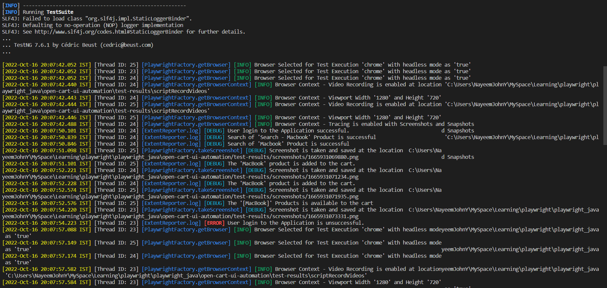
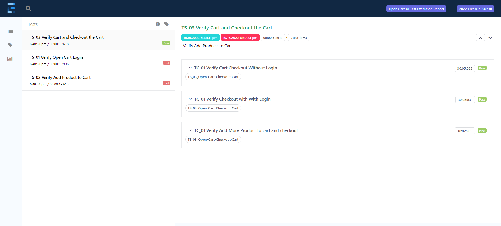
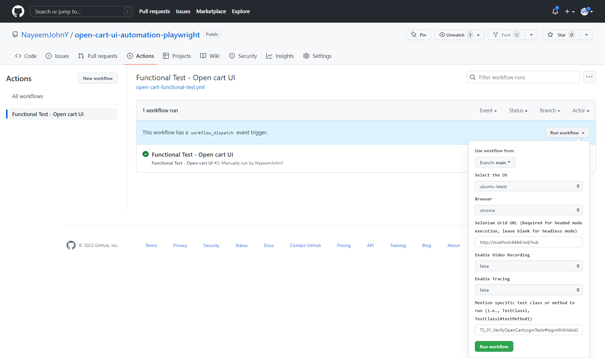
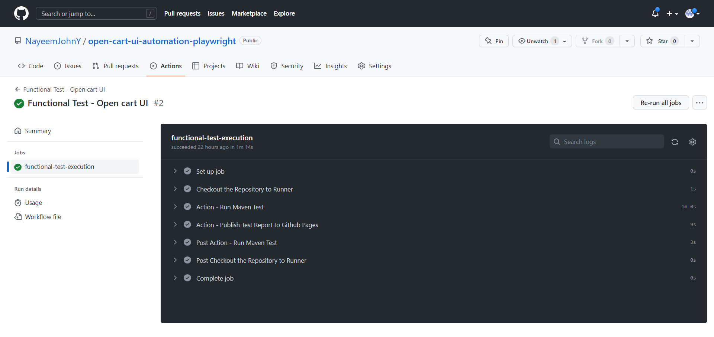

# Functional UI Automation Framework - Open Cart Website

This UI Automation framework repository has some basic functional tests for [Open Cart UI Website](https://https://naveenautomationlabs.com/opencart/). It covers the login, add products to cart and checkout cart functionality. The reports of test execution published in [Github Page](https://nayeemjohny.github.io/open-cart-ui-automation-playwright/) when the tests are executed from Github Actions.

This framework built with the following:

|                   |                       |
| ----------------- | --------------------- |
| Language          | **Java**              |
| Build Tool        | **Maven**             |
| UI Framework      | **Playwright**        |
| Testing Framework | **TestNG**            |
| Reporting         | **ExtentReports**     |
| Logging           | **Log4j**             |
| Design Pattern    | **Page Object Model** |
| CI                | **Github Actions**    |
| Remote Execution  | **Selenium Grid**     |


**Github page with javadoc and Test Execution Report can be found [here](https://nayeemjohny.github.io/open-cart-ui-automation-playwright/)**


#
## Key Notes

### Framework Design
- [PlaywrightFactory](./src/main/java/base/PlaywrightFactory.java) - Base class to create the playwright objects (Page, BrowserContext, Browser, Playwright)
  - Use the Test configuration to set up the browser and playwright Browser context with tracing, video recording, SessionState, View Port 
  - This exposes only few public methods (createPage(), takeScreenshot, saveSessionState())
  - **No ThreadLocal static variables** used for the playwright objects instead all are encapsulated in this class, only Page object is returned, still it supports the parallel execution, This has been improved the framework design.  
- [The pages package](./src/main/java/pages/) contains page objects and functional methods of each page 
  - Login page - login page objects and login functional method
  - Home page - home page objects and add to cart functional method
  - Shopping Cart page - Cart page objects and  checkout functionality method
- The script can take screenshots of specific step and can save the SessionState using playwright feature.
- Tried to reduce the static variables as much as possible. Only the methods, variables can be shared across all tests are created with static
- Code has been analyzed for code smell, code duplication and best practices using **SonarLint** on fly as well as **SonarCloud**

#
### Test Design
- Each test in the [tests package](./src/test/java/tests/) is independent and complete.
- [TestBase](./src/test/java/tests/TestBase.java) class uses the TestNG configuration annotations for set up and tear down.
    - **@BeforeSuite** : clean up results directory, Initialize the extent reports, logger and read test properties.
    - **@AfterSuite**  : tear down method to write (flush) the results to extent reports and assert all the soft asserts.
    - **@BeforeMethod** : Start the playwright server, instantiate the page and navigate to the website.
    - **@AfterMethod** : Stop the tracing (if enabled), Take screenshots (if test not success) and close the page instance.
    - **@BeforeClass** : This method used in each Test class to create the ExtentTest for reporting.
- For each Test new playwright server is launched which is isolated from other playwright instance.
- The current test design supports the **parallel execution** of TestNG test, This has been achieved by reducing the scope of the variables and objects are used.
- [TestRunner](./src/test/resources/testrunners/testng.xml) with the test class configuration. More test runners can be added here and same should be updated in the [pom.xml](pom.xml) surefire plugin.
- The test [addMoreProductToCartAndCheckoutTest](./src/test/java/tests/TS_03_VerifyCheckoutCartTests.java) are designed to use the playwright feature **Storage State**. The previous login state is used in this test

#
### Test Configuration
- The test configuration such as URL, username, Base64 encoded password, flags to enable/disable the video recording , tracing and location to store test results and artifacts are provided in the [config.properties](./src/main/resources/config.properties) file. This properties can be override by runtime properties if provided. 
- To read and update the properties, single instance of [TestProperties](./src/main/java/utils/TestProperties.java) class is used throughout the entire test execution. This has removed the usage of static variable of Properties class and passing of this variable across methods and classes. 

#
### Test Execution 
- The tests can be executed from maven test command or individual TestNG test from local after cloning the repo.
- sample maven commands
     ```command
        mvn clean test                          (OR)

        mvn clean test -DProperty=value         (OR)

        SELENIUM_REMOTE_URL="http://localhost:4444/wd/hub" mvn clean test
     ```
#
### Logger
- log4j2 logging framework is used. Logs were printed to console as well as saved to the file. The log configuration file with log pattern, Appenders is available at [src/main/resources/log4j2.xml](./src/main/resources/log4j2.xml).
- Logger is designed to support parallel execution and the logs will be printed with the **Thread Id**. 
  

#
### Reporting
- [Extent Spark reporter](./src/main/java/utils/ExtentReporter.java) is used for test reports. Configuration (Theme, timestamp, report name, document title) for report is available at [src/main/resources/extent-report-config.xml](./src/main/resources/extent-report-config.xml)
- Reports will be generated at the end of test execution. i.e, **@AfterSuite**
- All test in a single class captured in single ExtentTest with multiple test modes
- The system/environment variables in report are captured from the runtime/config properties.
- For each test class (considered as scenario) one ExtentTest is created and for each test under the scenario class, the Extent testNode is created. As a result the report looks like below. 
  

#
### GitHub Actions
- Workflow: workflow_dispatch is used in workflow, so the test can be executed triggered from actions ui
By default, the test will be executed on Ubuntu runner with headless mode.

- Few input parameters (os, browser, video recording, tracing, selenium grid (headed mode)) are exposed in Actions UI, which can be passed at runtime, to execute the test with different configuration.

-  [Main workflow file](./.github/workflows/open-cart-functional-test.yml) checkout the repository to runner host and uses the actions for maven test execution and GitHub page publish..

- [Run Maven Test](./.github/java-maven-testng-test-action/action.yml) action configure the Java and Maven in the runner host and then execute the test and prepare the test-results to be uploaded as artifact.

- [Publish Report to Github Page ](./.github/publish-github-page-action/action.yml) action prepare the test report for publish, configure the github page and publish the report to the github page.

    

    

#
### Selenium Grid using Docker:
    
* [docker-compose file](./selenium-grid-docker-compose.yml) to start the selenium grid with hub and node. It will pull latest images of hub, browsers, chrome, chromium, firefox and edge. Start the containers using docker-compose command and while triggering the test specify the grid node url in order the scripts to run on browsers with headed mode.

#
Please find the changelog for the latest updates [changelog](./changelog.md)

# 
<span style="float:right;" >
Prepared by
<a href= "https://www.linkedin.com/in/nayeemjohny/">
Nayeem John
</a>
</span>


 

