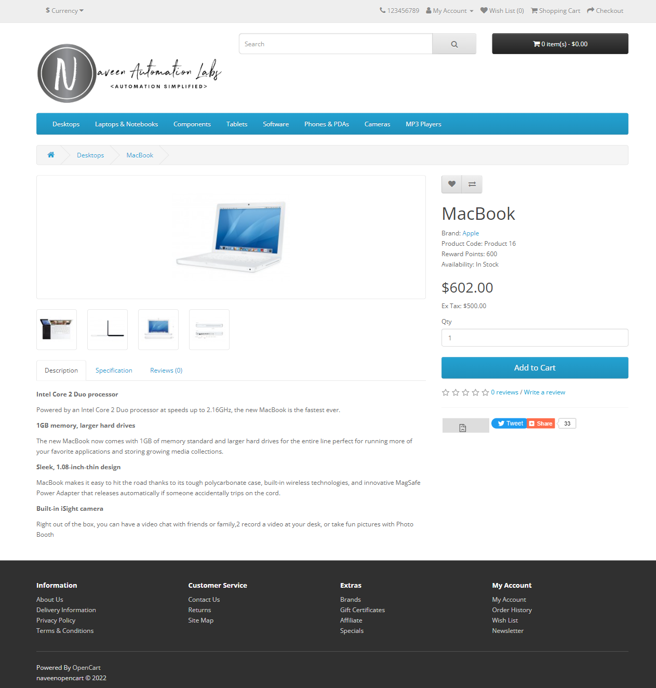
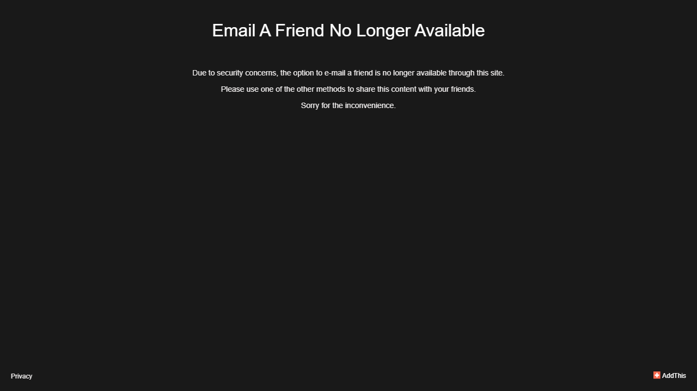

## October 24 2022

- **Playwright features covered:**
  - Frames, SelectOption, scrollIntoViewIfNeeded, hover, nested locator and locator Options (SetHas) and SetHasText())
  - Added waitForLoadState() for page to load completely before retrieve the page title. Used isVisible, textContext methods
  - Handled the **Page popup** (Windows/Tab) opened

- **Application feature test coverage:**
  - **Sort Products By Price**. Verified the sorting feature using **Java Map and Streams**
  - **Share Product** to multiple Social Platforms using **TestNG DataProvider**

- **Others**
  - Updated logger configuration to use **MarkerPatternSelector**
  - Updated extentLog with marker to log messages with caller class and method
  - Updated closePage @AfterMethod to use the **testName** from **ExtentTest** instead of ITestResult from TestNG to save tracing
  - Used **RetryAnalyzer** to Retry failed test cases
  - Discovered the known issue of playwright **[issue-scrolling-to-frame-not-in-view](https://github.com/microsoft/playwright/issues/3166)**
  
- **Application issues**
    -  Product share feature (addthis toolbox) for facebook option in page view (not in hover option) fails to launch sometimes due to **X-Frame-Options** is set to Deny.
    -  Facing above issue manually on first page load, after refresh this issue not appears. But in automation this issue persists even after refresh.

       -  
  
    -  The share count is not increased for the **facebook & twitter option in page view**.
    -  **EmailAFriend** option is still available as a service, even the option is no more supported.
  
       -  

#
## Initial 
 - This framework not covered entire playwright features. It covers only few features like Browser context options ( tracing, recording, session storage and view port) and elements handle methods (click(), fill() and waitFor())
 - Added javadoc for classes and methods
 - Added github actions to deploy javadoc as github page  